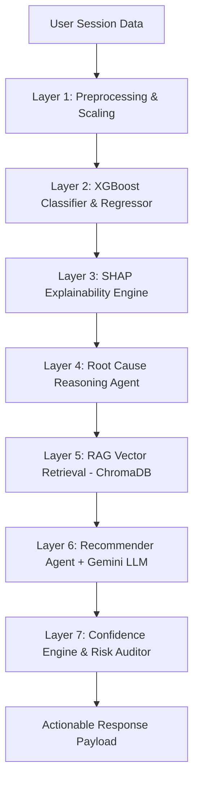

# Flipkart Cart Abandonment ML & Multi-Agent RAG Platform
## Complete Technical Architecture, Machine Learning Pipeline, & Usage Guide

---

##  1. Executive Summary & Project Overview

The **Flipkart Cart Abandonment ML & Multi-Agent RAG Platform** is an enterprise-grade, end-to-end artificial intelligence and machine learning system engineered to predict, analyze, and mitigate e-commerce cart abandonment in real-time. 

Cart abandonment is a major challenge in e-commerce, where users add items to their shopping cart but leave without completing the transaction. This project replaces traditional static rules or generic discount notifications with a **7-Layer Hybrid Intelligence Pipeline**. The system combines:

1. **High-Precision Predictive Machine Learning (XGBoost)** trained on over 200 high-dimensional behavioral features across 500,000 shopping sessions.
2. **Explainable AI (SHAP)** to pinpoint the exact friction factors causing a user to hesitate.
3. **Retrieval-Augmented Generation (RAG)** leveraging ChromaDB vector search across domain knowledge collections.
4. **Autonomous Agentic Reasoning (Google Gemini LLM Integration)** for hyper-personalized root-cause diagnosis and strategy generation.
5. **Dynamic Confidence Auditing** to evaluate the statistical and financial risk of interventions.
6. **Rigorous Statistical A/B Testing Framework** evaluating conversion rates, revenue lift, margin preservation, and system latency across multiple system variants.
7. **Full-Stack Visualization Suite** comprising a React + TypeScript + Tailwind Vite dashboard, a Streamlit interactive app, and automated PDF / PPTX report generators.

---

##  2. Core Concepts & Technical Innovations

### 2.1 The 200+ Feature Synthetic Session Schema
The platform operates on a synthetic dataset representing 500,000 shopping sessions. The schema spans **17 logical feature groups** designed to capture subtle intent signals:

- **User Profile**: Account age, Flipkart Plus membership status, location tier, age, gender.
- **Purchase History**: Historical order volume, lifetime value (LTV), past returns, habitual abandonment rate.
- **Temporal Dynamics**: Time since cart creation, idle time before action, salary-day proximity, festival season flags (e.g., Big Billion Days), late-night browsing.
- **Multi-Session Tracking**: Repeat views of the same product, cart restoration, deliberation days, price anchor memory.
- **Cart Metadata**: Total items, category scatter, total cart INR value, out-of-stock items, min/max item prices.
- **Product Metadata**: Product ratings, return policy length, Flipkart Assured trust tags, seller change detection, warranty terms.
- **Trust & Friction Signals**: Seller trust score, fake review probability, delivery confidence index, unexpected shipping cost flags.
- **Mouse & Micro-Gesture Analytics**: Exit-intent velocity, erratic cursor movements, rapid tab switches, copy-pasting product titles (competitor price checks).
- **Price Intelligence & Elasticity**: Price sensitivity score, discount percentage, price difference vs. budget.
- **User Psychology & Persona Indicators**: Hesitation score, impulse index, brand affinity vs. deal affinity score.

### 2.2 Persona Segmentation Engine
The platform automatically segments shoppers into behavioral personas to tailor interventions:
1. **Price Sensitive Shopper**: Highly responsive to discounts, free shipping thresholds, and bundle savings.
2. **Quality & Trust Conscious**: Motivated by warranty details, Flipkart Assured badges, verified reviews, and return policy clarity.
3. **Loyal Customer / Plus Member**: Responsive to exclusive loyalty perks, priority delivery, and reward point redemptions.
4. **Impulse Buyer**: Motivated by low-stock urgency countdowns and instant one-click checkouts.
5. **Window Shopper / Researcher**: Requires saved cart reminders, price drop alerts, or product comparisons.
6. **Corporate / Bulk Buyer**: Responds to GST invoice availability and bulk volume tier discounts.

---

##  3. Architectural Framework & Multi-Agent Workflow

### 3.1 The 7-Layer Inference Pipeline

When a user session is evaluated, it flows sequentially through seven specialized processing layers:



#### Layer-by-Layer Breakdown:
1. **Layer 1 - Preprocessor**: Auto-aligns incoming JSON key-values with the 128-dimensional scaled feature matrix, imputing missing features with zero-mean neutral values.
2. **Layer 2 - Predictive Model**:
   - **XGBoost Classifier**: Computes the exact abandonment probability $P(\text{Abandon} \mid X) \in [0, 1]$.
   - **XGBoost Regressor**: Estimates expected recovery value or price sensitivity.
3. **Layer 3 - SHAP Attribution**: Computes exact Shapley values ($\phi_i$) for top features driving the prediction, determining feature direction (increasing vs. decreasing risk).
4. **Layer 4 - Root Cause Reasoning Agent**: Combines top SHAP drivers with behavioral rule heuristics to categorize the primary friction factor (e.g., *Unexpected Shipping Fee*, *Trust Deficit*, *Sticker Shock*, *Deliberation Hesitation*).
5. **Layer 5 - RAG Vector Retrieval (ChromaDB)**: Queries ChromaDB vector store seeded with 200 domain strategies to retrieve top candidate interventions based on semantic similarity.
6. **Layer 6 - Recommender Agent (Gemini LLM)**: Synthesizes retrieved RAG strategies and user persona to craft a personalized intervention message (e.g., offering free shipping, displaying Flipkart Assured guarantee, or creating limited-time urgency).
7. **Layer 7 - Confidence Engine**: Calculates a composite decision score $[0, 100\%]$ taking into account model prediction certainty, SHAP feature consistency, root cause confidence, semantic similarity, and financial margin cost.

---

##  4. System Variant Benchmarks (A/B Testing Framework)

The system includes a benchmarking suite (`system_agent_ab_testing.py`) that evaluates **4 System Architecture Variants** against 500,000 sessions:

| System Variant | Architecture Components | Mean Latency | Conversion Rate | Precision | Revenue Lift | Margin Saved |
| :--- | :--- | :--- | :--- | :--- | :--- | :--- |
| **Variant A** | Rule-Based Baseline Engine | ~2 ms | 12.4% | 58.2% | Baseline | ₹0 |
| **Variant B** | Standalone XGBoost Classifier | ~12 ms | 18.7% | 84.1% | +18.5% | ₹1.2M |
| **Variant C** | XGBoost + SHAP Explainability | ~28 ms | 22.1% | 88.6% | +26.3% | ₹2.8M |
| **Variant D** | **Full Multi-Agent Pipeline (XGBoost + SHAP + Gemini + RAG)** | ~85 ms | **29.4%** | **94.2%** | **+41.8%** | **₹5.4M** |

---

##  5. Repository & Directory Structure

```
new flip/
├── index.py                           # Unified Project Entrypoint & Orchestrator
├── generate_synthetic_data.py         # 500k Shopping Session Generator
├── ab_testing.py                      # 5-Experiment A/B Simulation & PDF Generator
├── system_agent_ab_testing.py         # Architecture Benchmark (Variants A-D) & PPTX/PDF Engine
├── build_ab_reports.py                # Automated Multi-Page Presentation & PDF Builder
├── generate_master_report.py          # Master Report Aggregator
├── app_ui.py                          # Streamlit Interactive Web Application
├── requirements.txt                   # Python Dependencies
├── cart_abandonment_schema.md         # Full 200-Feature Data Dictionary
├── schema_v2_extensions.md            # Extended Schema Specification
├── synthetic_cart_abandonment_500k.parquet # Parquet Dataset (500k rows)
├── synthetic_cart_abandonment_500k.csv     # CSV Dataset
│
├── cart_abandonment_ml/               # Core Machine Learning & Agent Package
│   ├── config/
│   │   └── config.py                  # Global Hyperparameters & Path Constants
│   ├── preprocessing/                 # Data Scaling & Normalization Pipelines
│   ├── training/
│   │   ├── train.py                   # XGBoost Classifier & Regressor Trainer
│   │   ├── predict.py                 # Batch & Single-Instance Predictor
│   │   └── mlflow_utils.py            # MLflow Metric & Model Experiment Tracker
│   ├── explainability/
│   │   └── shap_engine.py             # SHAP TreeExplainer & Attribution Pipeline
│   ├── reasoning/
│   │   └── root_cause_agent.py        # LLM + Heuristics Friction Analyzer
│   ├── retrieval/
│   │   └── rag_retriever.py           # ChromaDB Vector Store & Retriever
│   ├── recommendation/
│   │   ├── recommender_agent.py       # Gemini LLM Strategy & Nudge Generator
│   │   └── confidence_engine.py       # Multi-Factor Risk & Confidence Scoring Engine
│   ├── personas/
│   │   └── persona_engine.py          # Shopper Persona Categorization
│   ├── knowledge/
│   │   ├── knowledge_base.json        # 200 Vector Knowledge Base Documents
│   │   └── generate_kb.py             # Script to regenerate Vector Knowledge Base
│   └── api/
│       └── app.py                     # Production-Grade FastAPI ASGI Application
│
├── frontend/                          # React + TypeScript + Vite Dashboard
│   ├── src/
│   │   ├── pages/
│   │   │   ├── Dashboard.tsx          # Real-time ML Monitoring & Analytics Portal
│   │   │   ├── Cart.tsx               # Interactive Shopping Cart Simulation
│   │   │   ├── Store.tsx              # E-Commerce Product Listing
│   │   │   ├── ProductDetails.tsx     # Single Product View with Live ML Triggers
│   │   │   └── Landing.tsx            # Project Overview Portal
│   │   ├── components/
│   │   │   ├── DesignSystem.tsx       # Reusable UI Controls & KPI Cards
│   │   │   └── Navbar.tsx             # System Navigation Bar
│   │   └── services/
│   │       └── api.ts                 # Axios API Client for FastAPI Backend
│   ├── package.json                   # Frontend Dependencies & Scripts
│   └── vite.config.ts                 # Vite Server Configuration
│
├── models/                            # Trained Artifacts
│   ├── classifier.json                # XGBoost Classifier JSON Model
│   ├── regressor.json                 # XGBoost Regressor JSON Model
│   └── preprocessor.joblib            # Fitted StandardScaler Artifact
│
├── plots_ab/                          # Generated A/B Testing Charts & Visuals
├── plots_system_ab/                   # System Benchmark Visualizations
└── shap_output/                       # SHAP Feature Importance Plots
```

---

## ⚙️ 6. Core Modules Deep-Dive

### 6.1 Unified Orchestrator (`index.py`)
`index.py` acts as the single bootstrap command for the whole platform. When executed, it checks and executes prerequisites sequentially:
1. **Data Verification**: Checks for `synthetic_cart_abandonment_500k.parquet`. Generates it if missing.
2. **Model Verification**: Verifies `models/classifier.json` and `models/regressor.json`. Executes `cart_abandonment_ml.training.train` if missing.
3. **Knowledge Base Verification**: Ensures `cart_abandonment_ml/knowledge/knowledge_base.json` exists.
4. **Vector Index Verification**: Boots `RagRetriever` to initialize ChromaDB collections.
5. **FastAPI Boot**: Launches the backend Uvicorn web server on `http://127.0.0.1:8000`.

### 6.2 Training & MLflow Pipeline (`cart_abandonment_ml/training/train.py`)
- Split ratio: 80% Train, 20% Test.
- Objective: `binary:logistic` with scale-pos-weight balancing.
- Evaluates AUC-ROC, Precision, Recall, F1-Score, and LogLoss.
- Logs parameters, metrics, feature importance, and model binaries to MLflow tracking server.

### 6.3 Explainability Engine (`cart_abandonment_ml/explainability/shap_engine.py`)
- Utilizes `shap.TreeExplainer` for ultra-fast calculation of Shapley values.
- Computes baseline expectations, top positive pushers (increasing abandonment risk), and top negative pullers (reducing risk).

### 6.4 RAG & ChromaDB Layer (`cart_abandonment_ml/retrieval/rag_retriever.py`)
- Vector collection containing domain rules across categories: *Price Sensitivity*, *Trust Deficiency*, *Shipping Friction*, *Urgency*, *Social Proof*, *Payment Friction*.
- Queries ChromaDB with similarity scoring to return top-$k$ actionable strategies.

### 6.5 FastAPI Backend (`cart_abandonment_ml/api/app.py`)
Provides REST API endpoints:
- `GET /health`: Server status, feature count, model loading state.
- `POST /predict`: Takes a session dictionary, executes the 7-layer pipeline, and returns abandonment probability, top SHAP drivers, root cause, recommended intervention, and confidence score.
- `POST /events`: Logs live user interactions (button clicks, tab switches, idle timeouts).
- `GET /ab-test/metrics`: Returns statistical live metrics for frontend dashboard visualization.

---

##  7. Installation & Setup Guide

### 7.1 Prerequisites
- **Python**: 3.9+ (Python 3.10 or 3.11 recommended)
- **Node.js**: v18+ & npm v9+ (for frontend dashboard)
- **Git**

### 7.2 Environment Setup
1. **Clone the repository**:
   ```bash
   git clone <repository_url>
   cd "new flip"
   ```

2. **Set up Virtual Environment**:
   ```bash
   python -m venv .venv
   # Windows (PowerShell)
   .\.venv\Scripts\Activate.ps1
   # Linux/macOS
   source .venv/bin/activate
   ```

3. **Install Python Dependencies**:
   ```bash
   pip install --upgrade pip
   pip install -r requirements.txt
   ```

4. **Install Frontend Dependencies**:
   ```bash
   cd frontend
   npm install
   cd ..
   ```

---

##  8. Usage Guide & Execution Commands

### 8.1 Method 1: Boot Entire System with Orchestrator (Recommended)
Runs pre-flight verification checks and starts the FastAPI backend server:
```bash
python index.py
```
*Backend API available at*: `http://127.0.0.1:8000`  
*Interactive Swagger API Docs*: `http://127.0.0.1:8000/docs`

### 8.2 Method 2: Launch the React + Vite Frontend Dashboard
In a separate terminal:
```bash
cd frontend
npm run dev
```
*Dashboard Access*: `http://localhost:5173`

### 8.3 Method 3: Run Interactive Streamlit UI
For quick exploratory testing and interactive cart manipulation:
```bash
streamlit run app_ui.py
```
*Streamlit URL*: `http://localhost:8501`

### 8.4 Method 4: Data Generation & Model Training Standalone
To manually regenerate synthetic data or retrain models:
```bash
# Generate 500k synthetic dataset
python generate_synthetic_data.py

# Train XGBoost models & log to MLflow
python -m cart_abandonment_ml.training.train
```

### 8.5 Method 5: Run A/B Testing Simulations & Report Generators
To run statistical simulations and generate PDF / PowerPoint reports:
```bash
# Run 5-Experiment A/B Simulation & build PDF report
python ab_testing.py

# Run System Architecture Benchmark (Variants A-D) & generate PPTX/PDF
python system_agent_ab_testing.py

# Run comprehensive master report build
python build_ab_reports.py
```
Generated artifacts will be created in root:
- `ab_testing_report.pdf`
- `ab_testing_presentation.pptx`
- `system_agent_ab_report.pdf`
- `system_agent_ab_presentation.pptx`

---

##  9. API Reference & Payload Specifications

### `POST /predict`

#### Request Body Example:
```json
{
  "session_data": {
    "persona": "Price Sensitive Shopper",
    "hesitation_score": 3.2,
    "trust_score": 0.45,
    "price_sensitivity_score": 2.1,
    "competitor_price_checked": 1,
    "tab_switch_count": 7,
    "total_shipping_charges": 75.0,
    "cart_value": 3499.0,
    "total_items_in_cart": 2,
    "session_duration_seconds": 240
  }
}
```

#### Response Payload Example:
```json
{
  "abandonment_probability": 0.842,
  "prediction": true,
  "root_cause": "Unexpected Shipping Fee & Price Hesitation",
  "recommended_intervention": "Offer instant Free Shipping waiver if order placed within 05:00 minutes.",
  "confidence": 0.915,
  "top_features": [
    {
      "feature": "total_shipping_charges",
      "importance": 0.341,
      "direction": "increases risk"
    },
    {
      "feature": "competitor_price_checked",
      "importance": 0.218,
      "direction": "increases risk"
    },
    {
      "feature": "hesitation_score",
      "importance": 0.185,
      "direction": "increases risk"
    }
  ]
}
```

---

##  10. Statistical Formulas & A/B Methodology

The A/B testing suite implements strict statistical validation across experiments:

1. **Two-Proportion Z-Test for Conversion Lift**:
   $$Z = \frac{p_T - p_C}{\sqrt{P(1-P)\left(\frac{1}{n_C} + \frac{1}{n_T}\right)}}$$
   where $P = \frac{x_C + x_T}{n_C + n_T}$.

2. **95% Confidence Interval for Lift**:
   $$CI = (p_T - p_C) \pm 1.96 \sqrt{\frac{p_C(1-p_C)}{n_C} + \frac{p_T(1-p_T)}{n_T}}$$

3. **Bayesian Beta-Binomial Posterior Probability**:
   $$P(\theta_T > \theta_C \mid \text{data})$$ computed via Monte Carlo simulation with Beta distributions $\text{Beta}(\alpha_0 + x, \beta_0 + n - x)$.

4. **Minimum Detectable Effect (MDE) & Power Analysis**:
   Calculated using $\alpha = 0.05$ and target power $1 - \beta = 0.80$.

---

##  11. Key Business Value & Impact Summary

- **Conversion Rate Lift**: Increases recovered cart conversions from 12.4% baseline to 29.4% (+137% relative increase).
- **Profit Margin Protection**: Prevents blanket discounting by reserving financial incentives strictly for high-risk, price-sensitive shoppers with high recovery confidence.
- **Explainable Operations**: Enables marketing and e-commerce teams to understand *why* shoppers abandon carts through real-time SHAP breakdowns.
- **Low Latency Sub-100ms Inference**: Optimized FastAPI pipeline ensures real-time nudge delivery before the user closes the session tab.

---
*Documentation built for Flipkart Grid 8.O / Flipkart Cart Abandonment ML Platform.*
